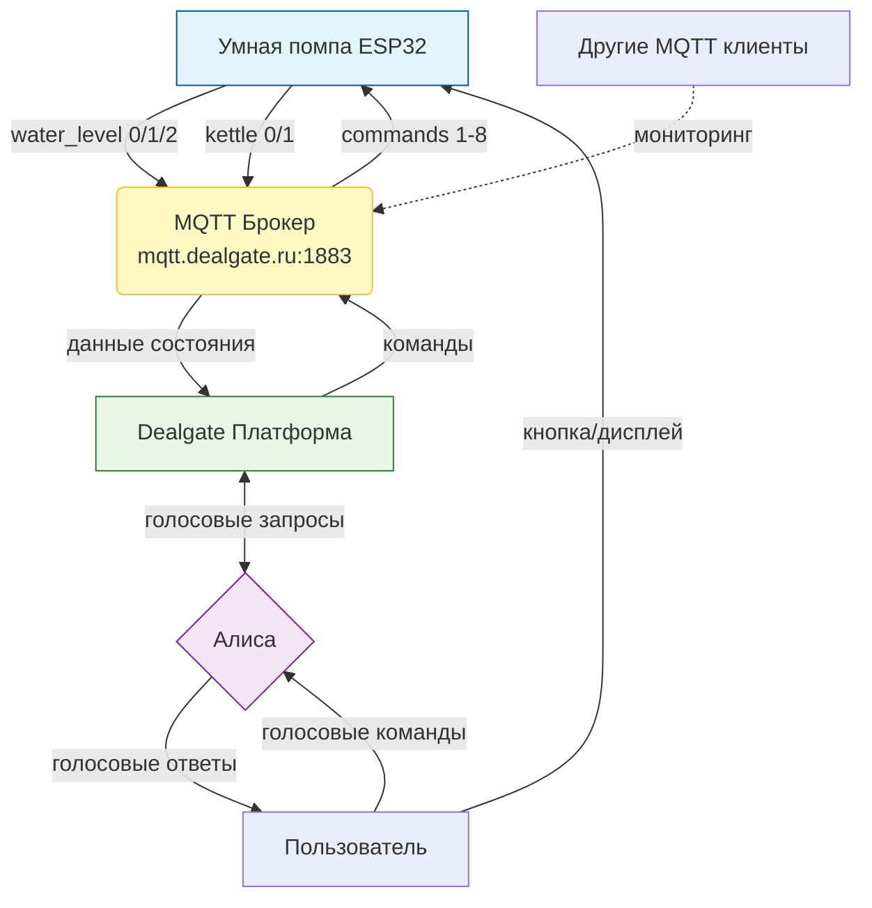

# Умная помпа на ESP32

Проект умной помпы на ESP32 с управлением через тактовую кнопку и MQTT-брокер Dealgate.ru для интеграции с голосовыми помощниками (Алиса).

## 📋 Описание проекта

Автоматическая система налива воды в чайник с голосовым управлением через Алису. 
Устройство контролирует уровень воды, управляет помпой и автоматически включает/выключает чайник.

## 🔧 Компоненты

- ESP32 - основной контроллер
- 2 реле (помпа + питание чайника)
- Тензодатчик HX711
- OLED дисплей SSD1306 (128x64)
- Сервопривод
- Тактовая кнопка
- Зуммер

## 📌 Распиновка

| Компонент | Пин ESP32 |
|-----------|-----------|
| Реле помпы | 26 |
| Реле питания чайника | 25 |
| HX711 DT | 16 |
| HX711 SCK | 4 |
| Кнопка | 27 |
| Дисплей SDA | 21 |
| Дисплей SCL | 22 |
| Сервопривод | 32 |
| Зуммер | 33 |

## 📡 MQTT топики

### Исходящие (с устройства)
- `/devices/pump/water_level` - уровень воды (0,1,2)
- `/devices/pump/kettle` - наличие чайника (0,1)

### Входящие (на устройство)
- `/devices/pump/filling` - команды налива (1-8)

## 🎮 Управление кнопкой

- **Одинарный клик:** налив одной кружки / до минимума
- **Двойной клик:** полный чайник
- **Тройной клик:** калибровка весов
- **Долгое нажатие (3с):** остановка налива
- **Удержание 5-15с:** сброс настроек с обратным отсчетом

## 🔧 Настройка

1. Загрузите прошивку на ESP32
2. Загрузите файлы из папки `data` в SPIFFS
3. При первом запуске подключитесь к Wi-Fi `Smart_Pump` (пароль: 12345678)
4. Перейдите по адресу `192.168.4.1`
5. Введите данные вашей Wi-Fi сети и MQTT учетные данные Dealgate

## СХЕМА ПЕРЕДАЧИ ДАННЫХ

## 👏 Авторы и благодарности

**Автор проекта:** vanovskiy

**Благодарность за помощь в разработке:**
- [DeepSeek](https://www.deepseek.com/) - помощь в написании кода, отладке, создании документации
  и подготовке репозитория для публикации на GitHub.
